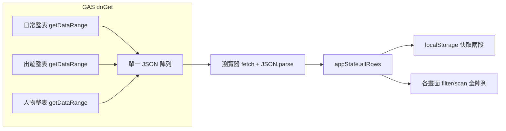

# 大量出遊／帳本列數時的效能改善（規劃稿）

> 試算表列數變多、載入或操作變慢時再依階段實作即可。維持「試算表為單一真相來源」的前提下，依成本由低到高分三層：先減少前端重複掃描與 DOM 成本，再考慮 GAS 增量同步或分頁，最後才是歸檔與架構拆分。

## 現況（瓶頸在哪）

- **後端**：[gas程式碼.md](./gas程式碼.md) 中 `doGet` 對三張工作表皆 `getDataRange().getValues()`，**永遠全量**。
- **前端**：[js/api.js](../js/api.js) `loadData` **一次拉整包**後 `normalizeRow`，寫入 [js/state.js](../js/state.js) 的 `allRows` 並 `saveCache()`。
- **衍生資料**：[js/data.js](../js/data.js) 等多處對 `allRows` **多次 `filter`／建 `Set`**，列數變大時 CPU 成本線性增加。
- **模型**：[js/model.js](../js/model.js) 的列型別為事件列，**沒有**內建「版本序號／自上次同步以來的變更」欄位，因此增量同步需**新增契約**（見下）。

---

## 第一階段：只改前端（實作成本低、中量資料就有感）

| 作法 | 目的 |
|------|------|
| 在 `allRows` 變更後建立**索引結構**（例如 `Map<tripId, rows[]>`、`Map<id, row>` for 事件去重）並讓 `getTripExpensesFromRows` 等熱路徑**優先走索引**，必要時再 fallback 全表掃描 | 把「每次開行程詳情都掃整份 allRows」從 O(n) 重複掃描降為 O(該行程列數) 或 O(1) 查表 |
| 出遊消費列表若單一行程筆數極多，對列表區塊做**虛擬捲動**（只 mount 可見列） | 避免上千 DOM 節點造成捲動與重排卡頓（與下載無關，但使用者體感常卡在這） |
| 背景輪詢 `loadData`：若回傳與本地 `rowsDataEqual` 相同則少做重繪（若尚未做滿） | 減少無效 UI 更新 |

此階段**不改 GAS**，適合先驗證「上千筆時卡的是網路還是畫面」。

---

## 第二階段：GAS + 前端「增量同步」（對「每次全量下載」改善最大）

事件列一律 **append**，理論上可用「自某序號之後的新列」合併到本地，而不必每次傳整表。

**建議契約（需試算表／寫入邏輯配合）：**

1. 新增欄位例如 `_seq`（或 `serverSeq`）：GAS 在每次 `appendRow` 成功後寫入**單調遞增**整數（可存在 PropertiesService 或獨立「序號表」一列）。
2. `doGet` 支援查詢參數，例如 `?sinceSeq=12345`：只回傳 `_seq > 12345` 的列（仍須掃表或維護輔助索引列，實作細節在 GAS 端選擇「掃尾端 N 列」vs「全表掃過濾」）。
3. 前端 [js/api.js](../js/api.js)：`loadData` 先帶上次儲存的 `maxSeq` 請求 delta；合併規則需與現有 `mergeFreshWithOutboxBackedPending` 一致，並處理**首次同步／序號重置／手動刪表列**時的 **full sync fallback**。

**注意：** 若使用者會在試算表手動刪列，僅靠「列數」不可靠，**序號欄位 + 偶爾全量校正**較穩。

---

## 第三階段：資料量再放大時（架構級）

- **回傳體積上限**：Apps Script Web App 回應過大可能觸發逾時或限制；可改為 **分頁 GET**（`?page=2&pageSize=2000`）或多段 JSON，前端串接。
- **歸檔**：將「已關閉且超過 N 個月的行程」事件列搬到 `出遊_歸檔` 工作表；平常 `doGet` 只讀主表 + 按需讀歸檔（開舊行程才請求）。商業邏輯與匯總要定義清楚（總資產是否含歸檔）。
- **替代儲存**：長期若達萬級以上，可評估後端資料庫 + API；與現有試算表 workflow 取捨較大，通常非第一步。

---

## 建議採用順序

1. **先做第一階段**：成本最低，且能解決「資料已下載但畫面仍卡」的情況。
2. 若瓶頸在**首次載入／同步時間／流量**，再做**第二階段**（需同步改 [gas程式碼.md](./gas程式碼.md) 與實際部署的 GAS 專案）。
3. 當單表列數或回傳 JSON 明顯逼近限制時，再評估**第三階段**分頁或歸檔。

**實作前要決定：** 增量同步是否可接受在試算表新增一欄（如 `_seq`）並讓所有新寫入都經 GAS append？（手動在試算表貼上的列若沒有序號，要有 full refresh 或補欄策略。）

---

## 實作檢查清單（待辦）

- [ ] 第一階段：為 `allRows` 變更建立 tripId／id 索引，熱路徑改走索引
- [ ] 第一階段：評估行程消費列表虛擬捲動（高筆數時）
- [ ] 第二階段：GAS append 寫入 `_seq`；`doGet` 支援 `sinceSeq` 增量回傳
- [ ] 第二階段：`api.js` delta 合併、`maxSeq` 持久化、full sync fallback
- [ ] 第三階段（可選）：歸檔表／分頁 GET（資料量極大時）
